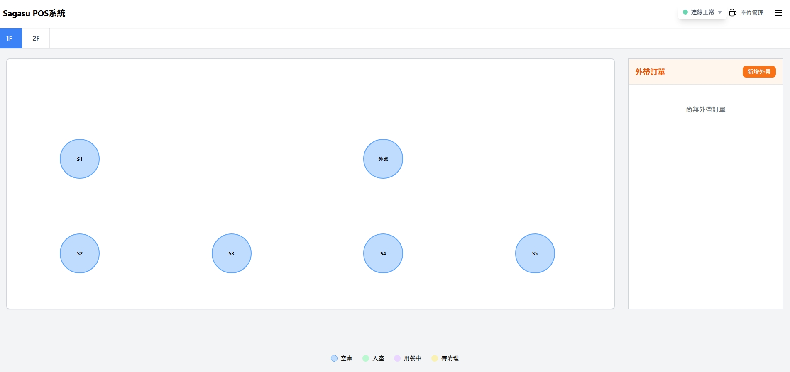
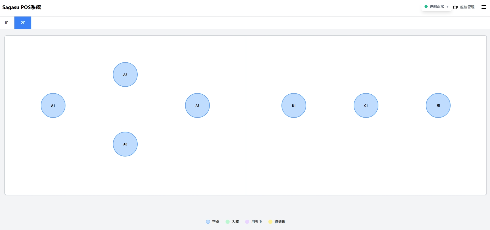
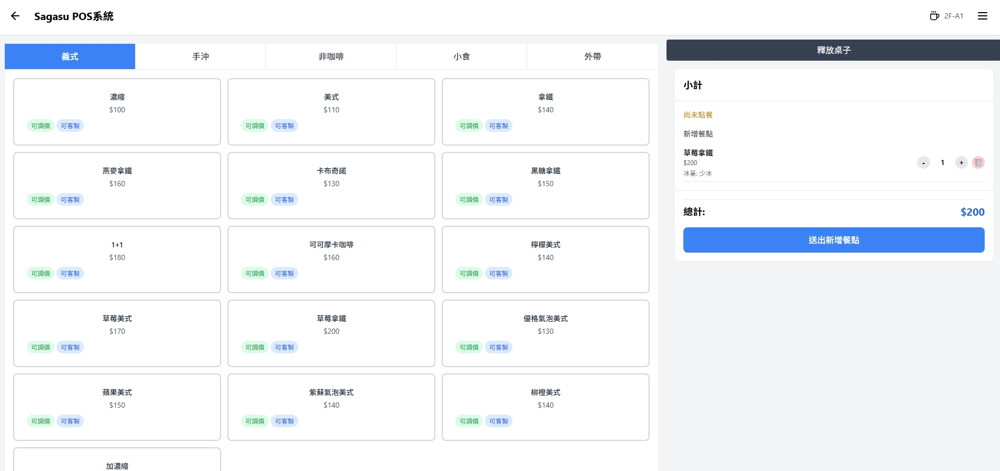
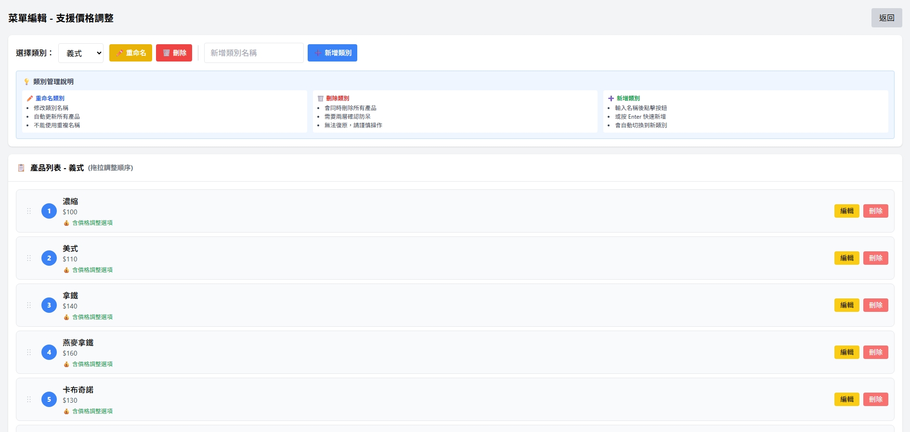
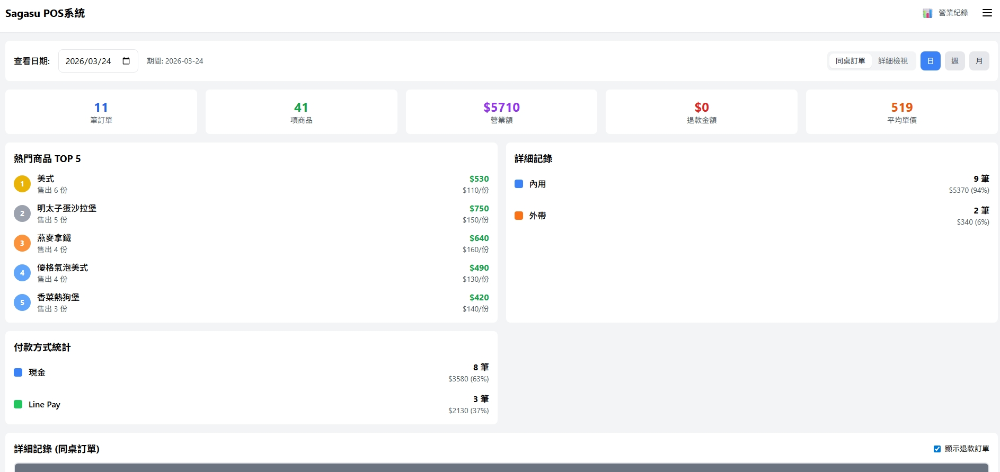
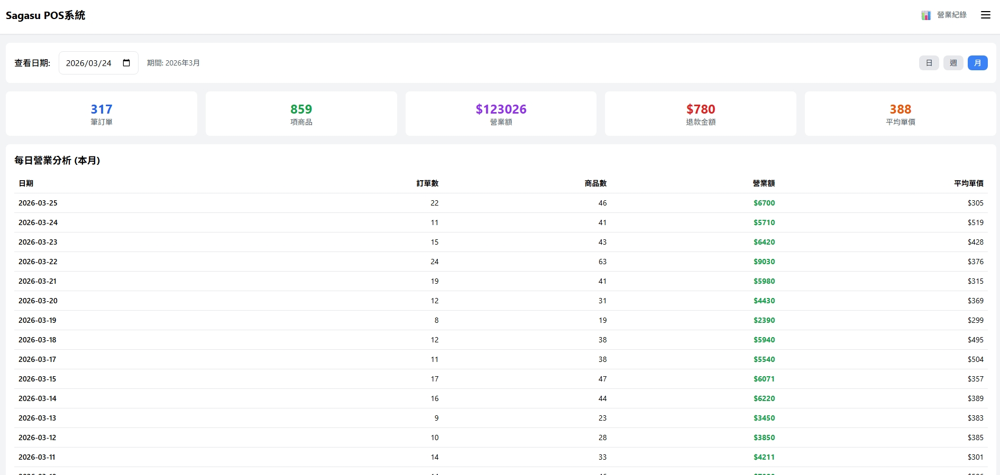
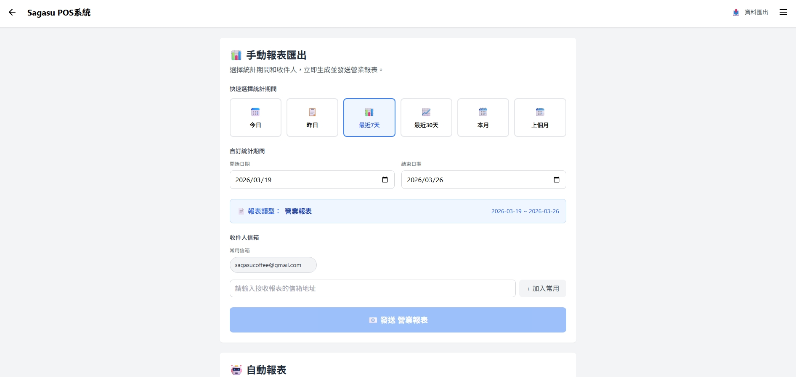
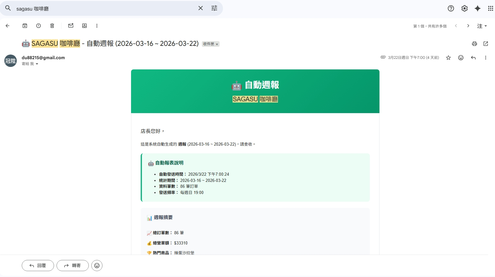
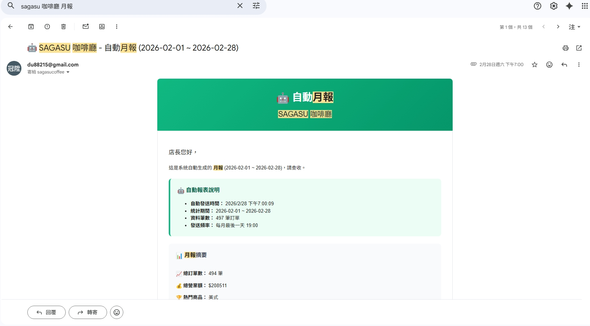
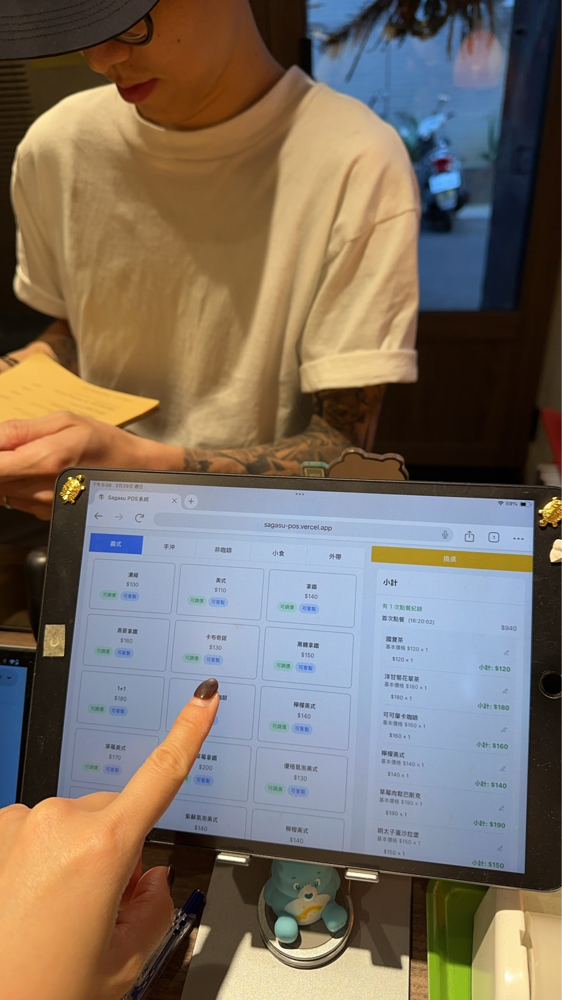

# ☕ Sagasu POS 系統

一個以 React 與 Firebase 打造的餐飲業 POS 系統，目前實際運作於 Sagasu 咖啡廳。
支援點餐、座位管理、菜單編輯、營業統計與自動報表寄送等完整功能。

**Live Demo：https://sagasu-pos-demo.vercel.app**
**Demo 密碼：demo1234**

> 展示環境連結獨立的測試資料庫，與正式營運資料完全分離。
> 正式系統：https://sagasu-pos.vercel.app（實際營運中，需授權登入）

---

## 截圖

| 座位圖（1F）                               | 座位圖（2F）                               |
| ------------------------------------------ | ------------------------------------------ |
|  |  |

| 點餐畫面                                   | 菜單編輯                                    |
| ------------------------------------------ | ------------------------------------------- |
|  |  |

| 營業紀錄（日）                              | 營業紀錄（月）                                |
| ------------------------------------------- | --------------------------------------------- |
|  |  |

| 手動報表匯出                                    | 自動週報 Email                                 |
| ----------------------------------------------- | ---------------------------------------------- |
|  |  |

| 自動月報 Email                                  |     |
| ----------------------------------------------- | --- |
|  |     |

---

## 功能特色

### 點餐與座位

- 視覺化座位圖（支援多樓層，座位固定配置於畫布上）
- 內用桌位點餐 / 外帶訂單分流管理
- 即時連線狀態顯示（連線正常 / 斷線警告）
- 座位狀態標示：空桌、入座、用餐中、待清理

### 菜單管理

- 類別管理（新增、重命名、刪除）
- 產品拖拉調整排序
- 價格調整選項（加價選項設定）
- 類別刪除雙重確認防呆

### 營業統計

- 日 / 週 / 月三種檢視模式
- 每日關鍵數據：訂單數、商品數、營業額、退款金額、平均單價
- 熱門商品 TOP 5
- 付款方式統計（現金、Line Pay 等）
- 內用 / 外帶比例分析

### 自動報表

- 手動匯出：自訂統計期間，一鍵產生並寄送報表
- 自動週報：每週日 19:00 自動寄送
- 自動月報：每月最後一天 19:00 自動寄送
- 常用信箱管理，報表附帶 CSV 附件
- 架構：前端呼叫 → Cloud Function → Nodemailer + Gmail SMTP

### 帳戶管理

- Email 登入 / 密碼修改
- 登入記錄查詢（時間、裝置瀏覽器）

---

## 技術棧

| 類別            | 技術                                          |
| --------------- | --------------------------------------------- |
| UI 框架         | React 19.1.1 (Hooks)                          |
| 樣式            | Tailwind CSS                                  |
| 後端 / 資料庫   | Firebase Firestore                            |
| 認證            | Firebase Authentication                       |
| 排程 / 後端邏輯 | Firebase Cloud Functions v2                   |
| Email 發送      | Nodemailer + Gmail SMTP（Cloud Functions 內） |
| 部署            | Vercel（前端）、Firebase（Functions）         |

---

## 本地安裝

### 環境需求

- Node.js 18+
- Firebase 專案（需自行建立）

### 步驟

```bash
# 1. Clone 專案
git clone https://github.com/Du-22/sagasu-pos.git
cd sagasu-pos

# 2. 安裝套件
npm install

# 3. 新增 .env 檔案並填入你的 Firebase 設定
```

在 `.env` 填入以下變數：

```
REACT_APP_FIREBASE_API_KEY=
REACT_APP_FIREBASE_AUTH_DOMAIN=
REACT_APP_FIREBASE_PROJECT_ID=
REACT_APP_FIREBASE_STORAGE_BUCKET=
REACT_APP_FIREBASE_MESSAGING_SENDER_ID=
REACT_APP_FIREBASE_APP_ID=
```

```bash
# 4. 啟動開發伺服器
npm start
```

---

## 專案結構

```
src/
├── hooks/              # Custom Hooks（useAuth、useOrderActions、useCheckout 等）
├── components/
│   ├── pages/          # 各頁面元件（OrderingPage、SeatingPage、HistoryPage 等）
│   └── UI/             # 共用 UI 元件
├── firebase/           # Firebase 模組（按功能域拆分：menu、tables、orders、sales、users）
├── auth/               # 認證相關頁面與工具
├── data/               # 靜態資料（defaultMenuData）
└── utils/              # 工具函式

functions/              # Firebase Cloud Functions（排程報表寄送）
```

---

## 專案背景

本系統為實際委託開發的專案，目前部署於台南 [Sagasu 咖啡廳](https://www.instagram.com/sagasu_coffee/?hl=zh-tw) 作為日常營運使用的 POS 工具。



> Live Demo 連結為展示用途，實際資料已與正式環境分離。

---

## 開發說明

本專案使用 [Claude Code](https://claude.ai/code)（AI 工具）輔助開發，包含程式碼生成與問題排查。核心邏輯設計、架構決策與功能規劃均由開發者主導。
